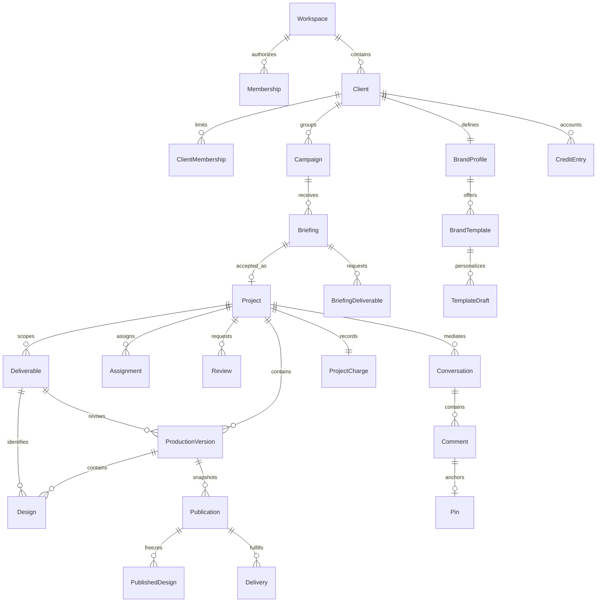
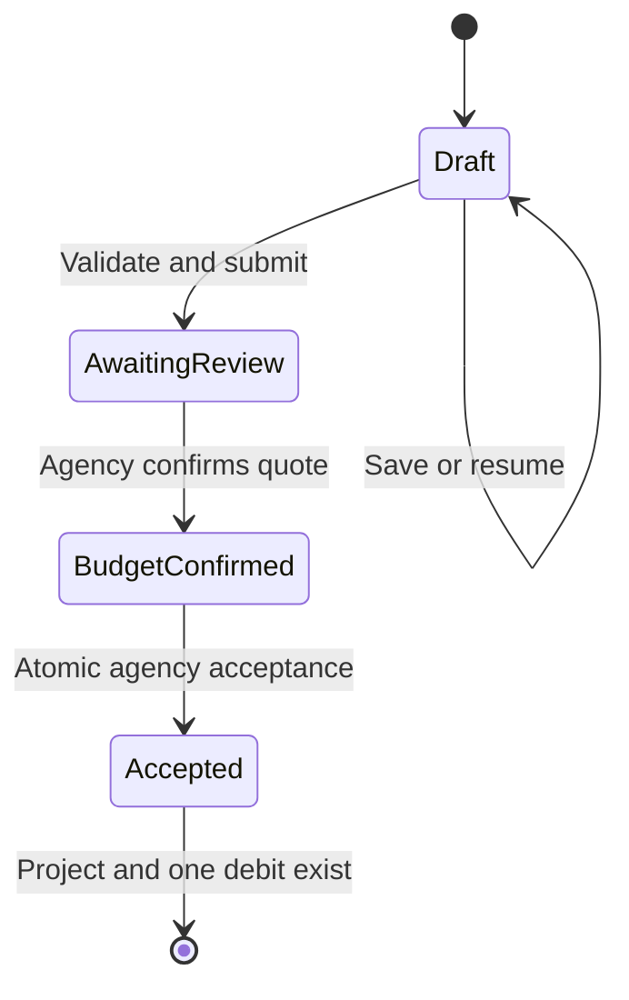

# Domain model and workflow invariants

Status: framework-neutral target domain. Names describe concepts, not implemented tables or classes. The backend may choose equivalent representations if it preserves these relationships, information boundaries, and transactions. Implementation remains unverified in [acceptance-matrix.md](acceptance-matrix.md).

Deployment scope is a single studio with ten canonical client workspaces. The Workspace concept is the installation's shared settings and protected agency context; it does not require a multi-agency SaaS tenancy layer. Client membership, assignment and parent consistency are the active data-isolation boundaries. Future separate studios can use isolated installations until multi-studio tenancy is explicitly requested.

## Domain boundaries

| Domain | Responsibility | Boundary |
|---|---|---|
| Workspace and identity | People, memberships, agency capabilities, authenticated context, invitations | Supplies authorization context; does not embed business workflows in navigation. |
| Clients and campaigns | Client directory, campaign grouping, dates and goals | Every campaign belongs to one client in one workspace. |
| Briefings and catalog | Service/format definitions, draft wizard, submitted scope, quote, acceptance | Acceptance coordinates project creation and ledger debit atomically. |
| Projects and production | Deliverables, assignment, versions, designs, files, planning | Internal production remains separate from client publication. |
| Publication and review | Immutable snapshots, submissions, review decisions, delivery | Reviews and approvals identify the exact reviewed revision. |
| Conversation | Project/design threads, channels, comments, normalized pins | A thread has one channel and an authorized anchor. |
| Brand Hub | Canonical brand direction, libraries, products, templates, reusable context | Canonical edits belong to Agency; personal drafts belong to their owner. |
| Credits | Quote snapshots, immutable ledger, balances, requests, reports | Balances are derived from posted entries, not editable client fields. |
| Administration and activity | Workspace configuration, presets, audit and notifications | Sensitive administration and internal audit are not client event feeds. |

Keep code, validation, types, data adapters, and meaningful unit tests close to their domain. Share a component or helper after a second real consumer appears. Avoid a global prototype component, generic catch-all utilities, duplicated role-specific domain rules, circular imports, and a monorepo without an actual independent package boundary. Framework routing and storage adapters may depend on the domain; domain invariants must not depend on UI widget state.

## Relationships

The diagram omits repeated workspace/client keys and auxiliary file relations for readability. Persisted records must still prove their full parent hierarchy. A draft briefing may initially have no campaign; submission requires an explicitly confirmed campaign. A newly created client may have a minimal initialized Brand Profile with incomplete sections.

## Entity contracts

| Entity | Required conceptual fields and behavior |
|---|---|
| Workspace | Stable ID, studio name, timezone, lifecycle status; owns clients and agency memberships. |
| Person / Membership | Authenticated identity, workspace, role/capabilities, active/revoked status; no client-controlled role field. |
| Client / ClientMembership | Workspace, display name, internal contact details, permitted client identities, status; membership determines client access. |
| Invitation | Workspace/client scope, allowed role, intended identity, expiry, token digest, inviter, accepted/revoked timestamps; one-time acceptance. |
| Campaign | Client, name, optional goal/start/end dates; no cross-client projects or briefs. |
| ServiceDefinition | Versioned catalog ID, name/category/description, optional min/max credit estimate, suggested days, allowed format IDs, conditional questions. |
| FormatDefinition | Catalog ID, name, unit (`px`, `mm`, `none`), layout (`fixed`, `fluid`, `none`), optional dimensions or size label. |
| Briefing | Owner, client, optional draft campaign, chosen service, title, step/status, structured answers/direction, attachments, due date, revision token, submitted scope snapshot. |
| BriefingDeliverable | Briefing, stable draft ID, chosen format, custom name, dimensions, quantity, Original/Adaptation, order. |
| Quote | Briefing revision, catalog/estimate snapshot, agency-confirmed integer total, adjustment explanation, author/time; accepted quote becomes immutable. |
| Project | Client/campaign/accepted briefing, title, lifecycle state, dates, public summary, accepted scope/brand/quote snapshots; excludes assignment from client projection. |
| Assignment | Project, designer identity, assigned/revoked timestamps, agency actor; separate internal relation. |
| Deliverable | Project, source briefing deliverable, format snapshot, custom name, dimensions/size rule, positive quantity, scope and order. |
| ProductionVersion | Project, deliverable, monotonically ordered revision number within that deliverable, internal notes, creator, change/review state; contains one or more alternative designs. |
| Design | Version, deliverable, stable ID, optional lineage to prior design, name/order, immutable source/preview file revision; multiple designs per version/deliverable allowed. |
| FileAsset | Workspace/client/project or brand owner, immutable object identity/content digest, safe filename, media type, size, upload state, permitted visibility. |
| Publication / PublishedDesign | Project, source version retained internally, publisher/time, client-safe version label, frozen public design/file metadata and immutable file content. Client reads this projection only. |
| Review | Project, exact internal version or publication, audience (`agency` or `client`), requester, pending/approved/changes_requested state, decision actor/time and feedback. |
| Delivery | Project/publication, immutable authorized file manifest, agency actor/time, delivered status; requires appropriate approval. |
| Conversation / Comment | Project, channel, optional internal design or published design anchor, authenticated author, safe text, timestamps; client presentation maps agency to Studio. |
| Pin | Comment, normalized `x` and `y` in `[0, 1]`, design reference inherited from conversation; pending UI pins are not durable comments. |
| BrandProfile | Client, identity/direction fields and version; owns ten section records and reusable resources. |
| BrandResource / BrandProduct | Client brand owner, category, type, metadata, immutable asset references, use/avoid rules; products contain Assets/Specs/Rules. |
| BrandTemplate | Client, category, format/dimensions, editable content schema, preview/asset references, revision; seven reference template types. |
| TemplateDraft | Owner person, client, template revision, design name/headline/body/CTA and preview settings, saved timestamps; no automatic project or credit relation. |
| CreditEntry | Client, signed integer amount, type, reason, event time, idempotency reference, authorized actor and optional project/quote; append-only after posting. |
| ProjectCharge | Unique project and accepted briefing, quote snapshot, one corresponding debit entry, deliverable explanation; not one charge per badge or design. |
| CreditRequest | Client, requester, selected package/amount, pending/fulfilled/declined state, fulfillment reference; a request is not a posted credit. |
| Notification | Recipient, scope, public/internal event type, safe summary and authorized destination, created/read time. |
| AuditEvent | Actor, tenant, action, target, timestamp and controlled change summary; internal audit access differs from client-safe Activity. |
| ViewPreference | Owner/context, board view/planning period/pan/zoom as appropriate; never authoritative workflow or permission state. |

## Briefing workflow

The backend states are `draft`, `awaiting_review`, `budget_confirmed`, and `accepted`. The interface can group an accepted briefing under **In progress** and links to the created project. Repeated submission cannot create multiple active accepted revisions. Accepted scope is not overwritten by subsequent catalog or brand edits; any later scope change must be an explicit audited revision with defined credit treatment.

New briefing starts at Type with no implicit campaign, even if the previous session used one. Type chooses one of the 20 services. Details groups Campaign, Deliverables, Briefing, Timing & files. Saving an incomplete draft is allowed; submitting validates campaign, title, primary service, deliverables, applicable service answers, and required direction. Optional content remains optional. Campaign parent, file owner, and every referenced resource must match the client.

Deliverable quantity is a positive integer. Fixed dimensions require valid positive width/height; fluid formats require width without inventing a fixed height; non-dimensional deliverables use the catalog label. Adding the same format again creates a named variation with its own identity. Selecting badges or copying a design does not charge credits.

Audience/style/resources are initialized from the selected client's Brand Hub. A project-specific override is explicit and can be restored to defaults while drafting. Submit/accept snapshots retain the actual chosen direction and referenced brand revision, so an agency brand edit does not silently rewrite an already accepted brief.

## Project, review, and publication workflow

| Current state | Command / actor | Next state and invariant |
|---|---|---|
| Brief | Start production / agency or assigned designer | Designing; accepted scope exists. |
| Designing or Revision | Submit version / assigned designer or agency | Agency review; exact internal version submitted. |
| Agency review | Request internal changes / agency | Revision; internal feedback recorded. |
| Agency review | Publish for review / agency | Client review; immutable publication and pending client review created together. |
| Client review | Request changes / authorized client | Revision; feedback attached to reviewed publication and client channel. |
| Client review | Approve / authorized client | Approved; approval identifies exact publication. |
| Approved | Deliver / agency | Delivered; authorized real files and delivery manifest exist. |

The backend status identifiers map to the reference labels as follows: `planned` = Brief, `in_progress` = Designing, `internal_review` = Agency review, `client_review` = Client review, `changes_requested` = Revision, `approved` = Approved, and `delivered` = Delivered. The final interface may use clearer equivalent English labels consistently across all views. Kanban and project status controls invoke these transitions; they cannot bypass publication, review, or delivery requirements. If agency workflow permits publishing its own prepared design, it still performs the internal readiness validation before publication. Additional reopen/cancel/archive operations require an explicit documented transition rather than silently introducing arbitrary state changes.

New version can initialize from the preceding version of the same deliverable, preserving names/order and immutable file references while assigning new version/design identities. Later content replacement creates a new immutable file revision. Prior comments remain attached to their original design/version or publication. The canvas is a projection of this model: deliverable format columns, ordered versions, then ordered designs. Version numbers are local to a deliverable, not a single project-wide counter. xyflow node positions are not the project hierarchy or authorization source.

Publication never exposes private source authorship. The publication transaction validates design selection, copies approved public metadata, references immutable client-authorized content, and records a client-safe event. Later internal design changes, names, files, comments, or assignments do not mutate a published snapshot. Later publication receives a new ID; old review history remains readable within scope.

Client approval and agency internal approval are distinct events. A client's request for changes returns to the agency; the agency communicates the appropriate direction to the designer in the internal channel. There is no direct client-designer thread. Designer notification text must not quote the client's private channel.

## Credits and reporting

Catalog ranges are estimates for the service scope, not a per-badge price formula. **Other** has no automatic price or timing and requires an agency estimate. The agency confirms one positive integer project total; any required adjustment/custom estimate has an explanatory note visible in the client report.

Acceptance locks the briefing and relevant account state, verifies a valid quote and sufficient available credits, creates one project, records one negative ledger entry, stores the charge snapshot, and links the accepted briefing in the same transaction. Unique acceptance/project-charge references and idempotency keys prevent repeated or concurrent debits. Any failure rolls the transaction back. Client-side button disabling is supplementary.

Balance equals the sum of posted ledger entries. A display cache must reconcile to this sum. Additional-credit requests cannot alter the balance; only authorized allocation or verified fulfillment can post a positive entry. Corrections use compensating entries with reasons, preserving history. Concurrent spending cannot overdraw the account. Source/payment settlement references are unique.

Report dimensions are client, UTC event time, campaign, project, activity type, and period. CSV columns preserve the [reference contract](../ref/01-agencia/08-creditos/exemplo-exportacao.csv): Client, Date (UTC), Project, Campaign, Activity, Credits, Balance after activity, Deliverable breakdown, Agency adjustment. Rows explain original/adaptation quantities and sizes without splitting a single project debit into extra charges. CSV quoting and formula-injection handling protect user-supplied fields. A filtered report is not a new balance ledger.

## Brand Hub and template data

The ten sections are Overview, Logos, Colors, Typography, Visual Style, Product Library, Brand Assets, Templates, Copy & Messaging, and AI Brand Instructions. Keep their distinct schemas and UI responsibilities instead of a giant unvalidated document blob. Lightweight structured records are acceptable where constraints are explicit.

Logo variants cover Primary, Secondary, Wordmark, Symbol/Icon, White, Black, Horizontal, Vertical. Asset categories cover Logos, Icons, Patterns, Textures, Photography, Product renders, Illustrations, 3D, Mockups, Templates, Social assets, Video, Fonts. Reference file formats include SVG, PNG, JPG, PDF, PSD, GLB, FIG, MP4, TTF; supported upload handling must be explicit for each rather than pretending every format is safely previewable.

Messaging stores brand voice, tone, headlines, taglines, CTAs, descriptions, approved claims, allowed/forbidden terms, and avoid rules. AI Brand Instructions combines canonical brand direction with Use/Never rules into copyable context. No model provider is required merely to generate that text. The AI-Enhanced Add-On remains a service request type; selecting it does not automatically execute AI work or incur external charges.

Personal template drafts are persistent editable derivatives, partitioned by owner and client. Agency staff cannot read a client's private draft solely because they can edit canonical templates. Editing or saving a draft never creates a project, sends a review, publishes a client snapshot, or changes credits. Explicit production handoff would be a separate future command with its own requirements.

## Consistency and failure behavior

Use stable IDs, tenant-consistent parent constraints, optimistic revision checks for editable drafts/properties, and atomic workflow commands for multi-record changes. Persist comments before acknowledging send. Retry with an idempotency key where duplicate writes would matter. File uploads complete or report failure before a design/delivery is advertised as available; abandoned uploads are discoverable for cleanup.

Keep domain state durable across browser reload, backend restart, and repeated fixture creation. Use database authority for assignments, balances, status, and access; browser state is a cache. Notifications may be delivered asynchronously after the source transaction but must be deduplicated and reauthorized before emission. Missing/revoked resources render a safe unavailable state; transient transport failure renders retry rather than a misleading empty list.

## Catalog inventory

The [source catalog](../ref/00-guia/CATALOGO-DE-SERVICOS.json) is the authoritative captured service definition, with `types` (20 entries) and `formats` (25 entries). Preserve all IDs, estimates, timing, categories, format associations, and conditional question options when converting it to production data. Runtime presets may create new versioned definitions; existing accepted projects keep their original catalog snapshots.

| Service ID | Name | Estimated credits | Suggested days | Conditional question IDs |
|---|---|---|---|---|
| `ai` | AI-Enhanced Add-On | 1–2 | 2 | task |
| `blog` | Blog Design / Infographic | 3–5 | 5 | content |
| `guidelines` | Brand Guidelines | 10–15 | 14 | pages, content |
| `specialty` | Branded Specialty Design | 6–10 | 7 | template |
| `production` | Content Production | 3–6 | 5 | production |
| `direction` | Creative Direction / Operations | 3–10 | 30 | scope |
| `deck` | Deck / Presentation Design | 5–9 | 7 | pages, content |
| `animated-ad` | Digital Ad (Animated) | 3–6 | 3 | duration, production |
| `static-ad` | Digital Ad (Static) | 2–4 | 3 | content |
| `email-hero` | Email Hero | 1–2 | 2 | content |
| `email` | Full Email Design | 4–7 | 5 | sections, content |
| `gif` | GIF Animation | 3–6 | 4 | duration, content |
| `print` | Printed Marketing Materials | 6–12 | 7 | print, content |
| `reel` | Short Video / Reel | 3–6 | 5 | duration, production |
| `branding` | Simple Branding Package | 12 | 10 | brand |
| `social` | Social Post (Static) | 1–2 | 3 | content |
| `web` | UI Web Layout | 10–15 | 10 | sections, content |
| `whitepaper` | Whitepaper | 5–9 | 7 | pages, content |
| `youtube` | YouTube Video | 5–10 | 7 | duration, production |
| `other` | Other | Agency estimate required | To be agreed | scope |

## Implemented administrative contract

The installation persists one workspace name and IANA timezone. Service preset revisions override current estimate ranges and suggested delivery days for new briefings while preserving the canonical twenty-service/twenty-five-format definitions. Accepted briefing/project budgets remain snapshots. The Other service retains an agency-defined custom estimate.

An invitation stores an email-bound role/client scope, seven-day expiry, and a private token digest. Email confirmation establishes the Auth identity; accepting the opaque invitation token performs the authorized role/membership change. Sending an email alone does not grant workspace membership. Existing access cannot be silently replaced. The application supports real recovery-email verification and account password updates. Local SMTP capture is an operational test service, not a production delivery claim.
