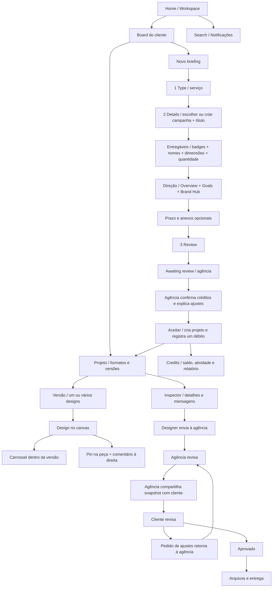

# Mapa das telas e fluxos

## Brand Hub

Overview → Logos → Colors → Typography → Visual Style → Product Library → Brand Assets → Templates → Copy & Messaging → AI Brand Instructions.

- Overview: identidade, público, tom, regras e diretrizes.
- Logos: oito variações, formatos SVG/PNG/PDF e orientações.
- Colors: códigos e cópia HEX/RGB/CSS/Tailwind.
- Typography: hierarquia, texto de teste e fonte de referência.
- Visual Style: referências e regras de fotografia.
- Products: cada produto abre Assets, Specs e Rules.
- Brand Assets: pesquisa, categorias, detalhes, copiar referência e cadastro pela agência.
- Templates: categorias e editor de rascunho pessoal. Não cria projeto nem cobrança.
- Messaging: textos e regras de linguagem reutilizáveis.
- AI: contexto de marca reutilizável. Não existe serviço de IA conectado.

## Ações globais

Search; Notifications; navegação entre clientes; expandir/recolher sidebar. Apenas agência: conta, ajuda, reset, configurações e criação de cliente.

## Estados de navegação

- Board: Timeline / Kanban / List, filtros, busca, planning recolhido e vazio.
- Projeto: formato específico, V1/V2, múltiplas peças, comentários vazios/preenchidos, pin pendente/selecionado, zoom, envio e entrega.
- Briefings: All / Draft / Awaiting review / In progress; rascunho, enviado e aceito.
- Reviews: Waiting for review / Approved; feedback, pedido de alterações e aprovação.
- Créditos: saldo/atividade, relatório, filtros, breakdown, CSV, plano e recarga simulada.
- Indisponibilidade: projeto de sessão anterior e rascunho de template expirado.

Use `TELAS.md` e `manifest.json` para associar cada estado ao PNG correspondente.
