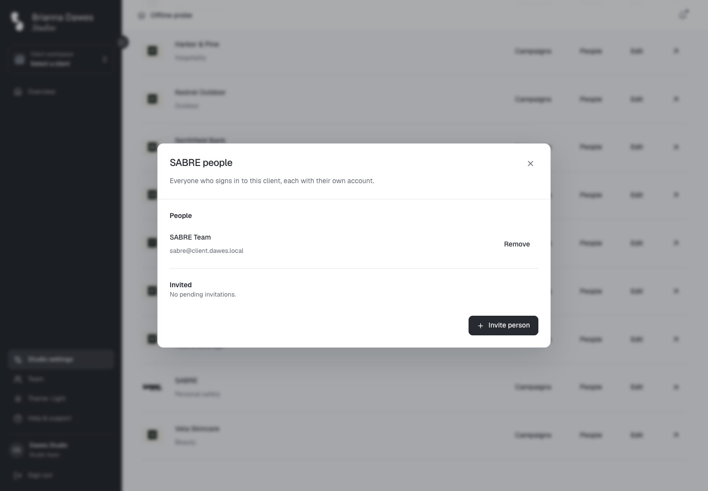
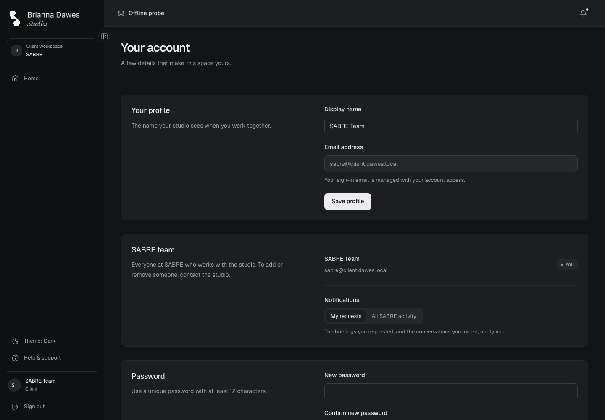
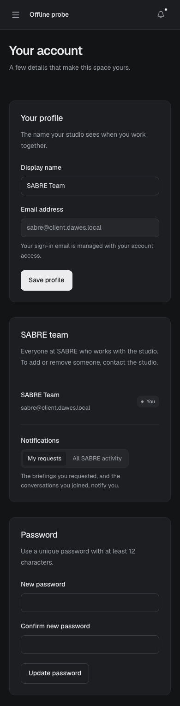
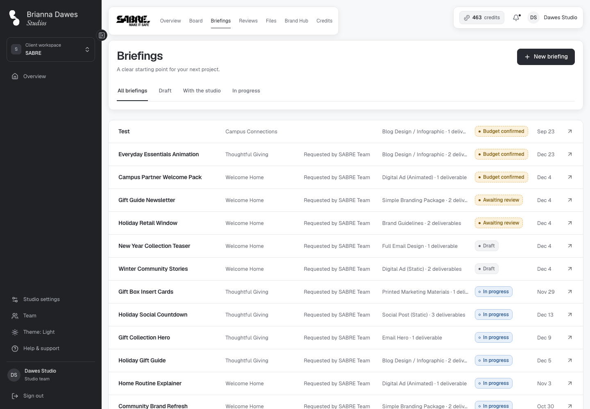
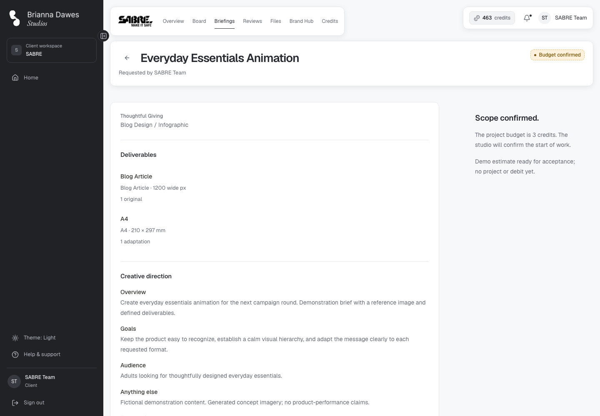

# Several people in one client — verification

Date: 2026-09-26 · Orchestrator: Claude Code · Workers: Sonnet (implementation, task reviews),
Haiku (checks), Opus (plan and final review)

Scope: [design](../superpowers/specs/2026-09-25-client-team-design.md) and
[plan](../superpowers/plans/2026-09-25-client-team.md), this plan's commits from `1fedc6f` to
`811c5b3` on local `main` plus this record. Another session committed Miro version links in the
same range; those commits are not part of this record. Each task was reviewed for spec compliance
and quality before the next began; worker reports are `docs/engineering/handoffs/2026-09-25-client-team-*.md`
and `2026-09-26-client-team-final-fixes.md`.

## What the user gets

- **A login per person.** The studio opens **People** on a client in Settings → Clients to see who
  signs in, invite someone and remove them. Removing someone who belongs to another client only
  ends this client's access; removing their last client deactivates the account and blocks sign-in
  (**Finish removal** retries that step, even after a reload).
- **Each person's team.** Your account shows one "<client> team" section per client: the people,
  "You", "To add or remove someone, contact the studio.", and **My requests** / **All <client>
  activity**.
- **Requested by.** A client's first save names them; the studio chooses the person when it files
  on a client's behalf (a one-person client defaults to that person) and can change it later. The
  Briefings list, the briefing page and project details show "Requested by <name>"; a person who
  left reads "<name> (left)" to the studio and "Former member" to the client.
- **Approved by.** Reviews and a project's version history read "Approved by <name> · <date>" or
  "Changes requested by <name> · <date>" for new decisions.
- **Notifications go to the requester.** Project notifications reach the briefing's requester,
  people who chose all activity, and (for a studio reply) people who wrote in that conversation;
  without an active requester everyone is notified. Credit notifications still reach everyone.
- Designers see no requester or reviewer, and no client can read another client's people.

## Checks executed in this session

| Check | Result |
| --- | --- |
| `npm run check` at `517bbb0` (typecheck, lint, format, unit tests) | Pass, 1145 tests in 103 files |
| `supabase test db` at `517bbb0` | 24 files, 593 tests; only `access_and_workflows.test.sql` fails, on its six known SABRE-overlay assertions (2, 4, 9, 18, 32, 54); `client_team.test.sql` 103 of 103 |
| Playwright at `517bbb0`: `client-team`, `team-management`, `briefing-modal`, `intake-admin`, `production-workflow`, `project-feedback`, `overview`, `client-navigation`, `client-pages-layout`, `theme`, `console-errors` | 41 passed, 0 failed, 0 skipped (the same set passed 41 of 41 before the final fix wave) |
| `client-team.spec.ts` repeatability | Green on every run this session; on five consecutive worker runs the Auth user, client, project and related counts were identical before and after |

`517bbb0` includes the other session's Miro commits; the dev server was restarted with a cleared
cache just before these runs, so they exercised the current CSS.

## Visual audit

36 captures at the final code: the People dialog, a client's Team section, the Briefings list as
the studio and as the client, a briefing page as the client, and Reviews as the client, in light
and dark at 1440, 900 and 390 px. No horizontal overflow; copy, gating and states match each role.

## Findings fixed during task reviews

- Task 4: **Finish removal** said "loses access" after access had ended; the confirmation's close
  button now waits for the request; loading and error states gained tests.
- Task 8: the worker report exceeded the 30-line cap.
- Task 9: the phone check gained a guard against an empty designer list, and each cleanup step now
  runs even when another fails.
- An earlier plan's `intake-admin.spec.ts` still expected invited clients to land on the Board
  (`ae882d8`); it now expects their Overview, and all six of its tests pass.

## Final whole-branch review

An Opus review of the plan's range found no Critical or Important issue and confirmed isolation,
authorisation, requester rules, routing and removal against the live database. One fix wave
(`043c177`, `25fc384`, `811c5b3`), confirmed by a scoped re-review, changed:

- A requester change no longer re-runs the briefing scope checks (migration `202609260002`), so a
  later catalog change cannot block it; a studio save treats a requester who left as missing,
  applying the one-person default or asking for a choice.
- New database tests: a requester change on an accepted briefing leaves `updated_at` alone and
  causes no false edit conflict.
- The People dialog's phone check measures the dialog itself; the pending confirmation also
  switches wording after a failed first attempt; removal errors say "the studio"; designers get no
  empty requester column; `permissions.md` describes the kept membership row.

Parked: the canvas version panel shows a decision without the reviewer's name (project details'
version history names them; that panel sits in the area the Miro session is changing).

## Remaining gaps

- A person who already belongs to one client cannot accept an invitation to a second client, and a
  removed person cannot be re-invited (`accept_invitation`, unchanged by this plan).
- Browsers: Chromium only. The overlay-count suites keep their known SABRE failures.
