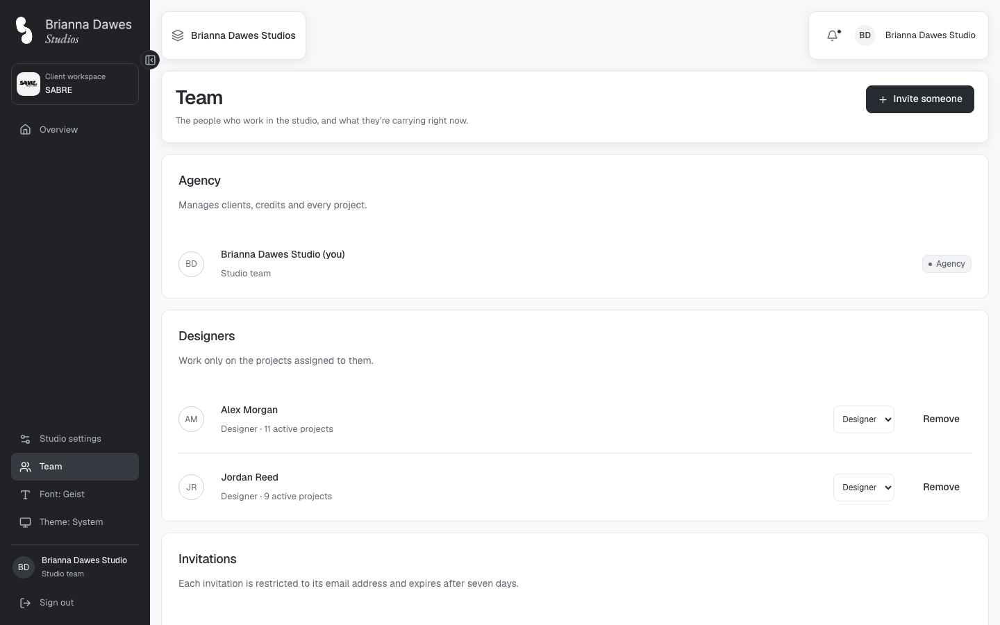
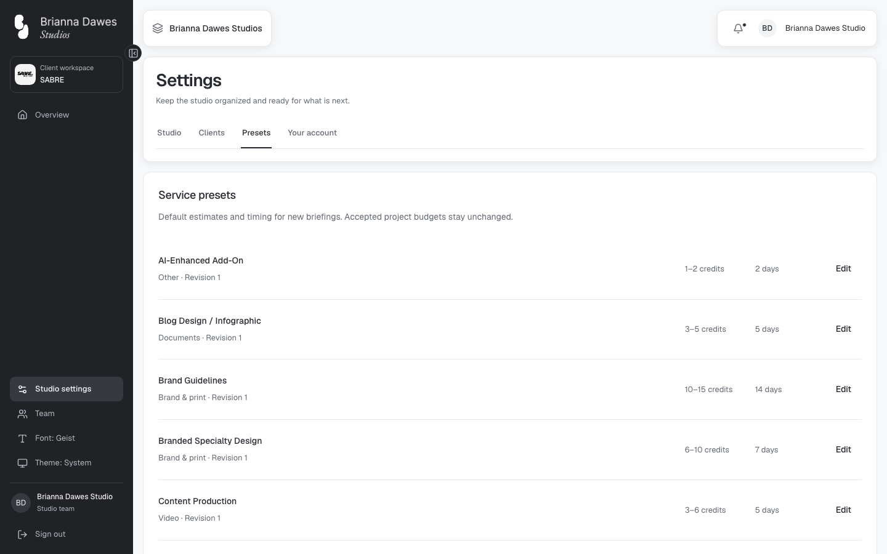
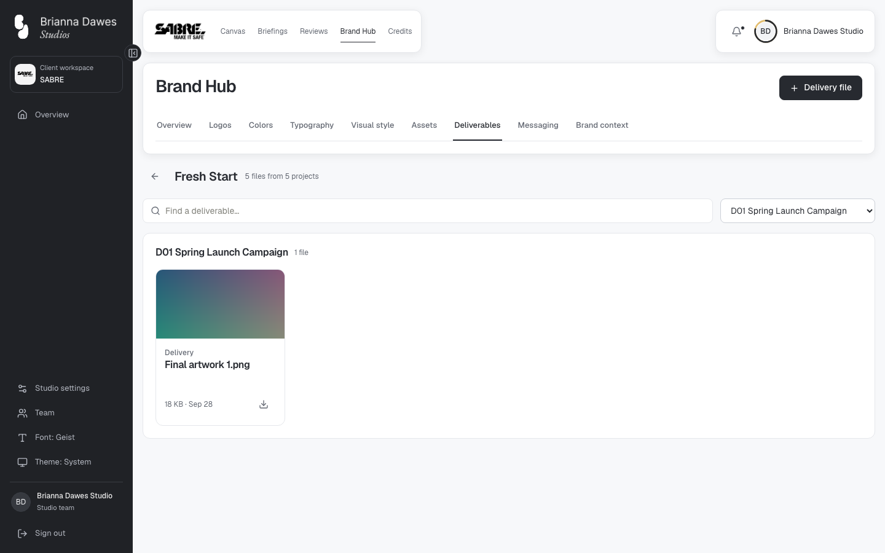
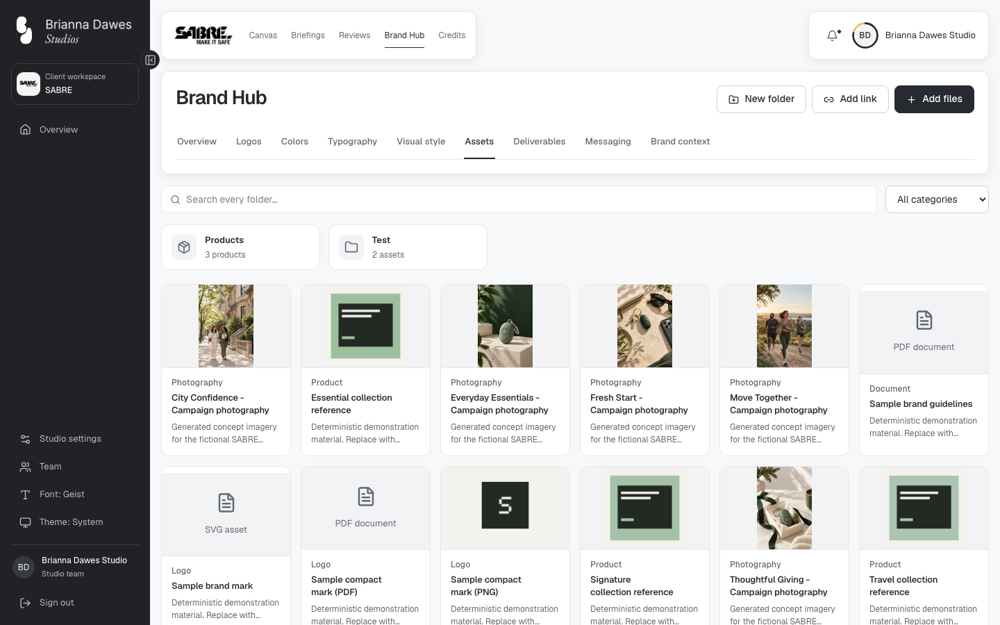
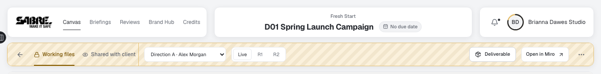
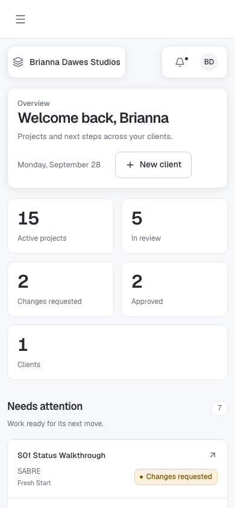
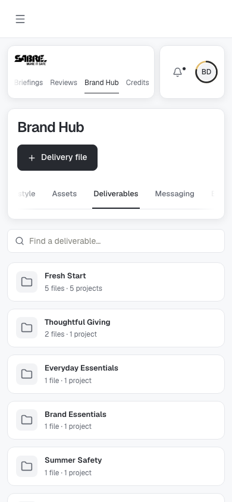

# Page consistency, Deliverables and bulk brand uploads — 2026-09-28

Requested by the user on 2026-09-28. Checks below were run in this session against the local SABRE
funnel dataset (web :3003).

## Changes

1. **One page structure.** Studio pages (Overview, Team, Notifications, Settings) now use the same
   floating header cards and white title card as client pages (`StudioHeader`, `.card-workspace`,
   `.page-chrome`, `.card-heading`; the former `client-page-*` classes were renamed because they are
   no longer client-only). Team lists **Agency** first, then **Designers**, then **Invitations**,
   each in a card, with **Invite someone** in the title card. Settings tabs sit inside the title card.
2. **Help & support** removed from the sidebar.
3. **List sort** cycles ascending → descending → default order; Status steps through the statuses
   present and then returns to the default order.
4. **Delivered projects** show a **Deliverable** link beside Open in Miro (agency and client), opening
   the project's Deliverables.
5. **Brand Hub** puts every section's actions in the title card (`shared/header-actions.tsx`) with the
   tabs below, and search/filters in one `.hub-toolbar` row. **Files is now Deliverables**: delivery
   files only (working files and the All/Approved toggle retired), one card per project, and the
   delivery dialog holds the project's **Google Drive backup** link.
6. **Assets** accepts many files at once (drop or **Add files/Add images**) into the open folder;
   details are edited afterwards from the asset dialog (**Edit details**, agency).

## Checks executed

- `npm run check`: 133 files / 1,299 tests, types, lint and format PASS.
- Playwright (chromium), PASS: `deliverables`, `files-campaigns` (2), `brand-folders`,
  `brand-guidance` (retry/orphan), `brand-accessibility` (3), `client-pages-layout` (3),
  `miro-workspace`, `action-workflow`, `board-views` except the item below.
- Real browser drop of two PNGs into the "Test" folder created two assets named from their files in
  that folder; Edit details opened in the asset dialog. The two test assets and their Storage objects
  were then deleted.
- Title cards start at the same offset on studio and client pages (102 px at 1440 × 900); no
  horizontal overflow at 390 px on Home, Team or Brand Hub.

## Not passing / not run

- `board-views` "live SABRE board fits every view": canvas centering is off by 92 px on the live
  dataset. The check concerns the canvas placement from commit `fbb8189`; this task did not change
  the canvas.
- `action-notifications`: expects a designer "Submit round" action that the current live data does
  not hold. The handoff already lists specs that need other data.
- Other e2e suites were not run.

## Screenshots

