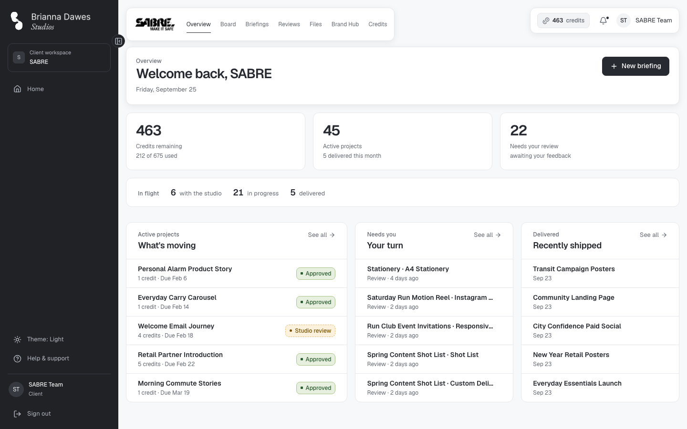
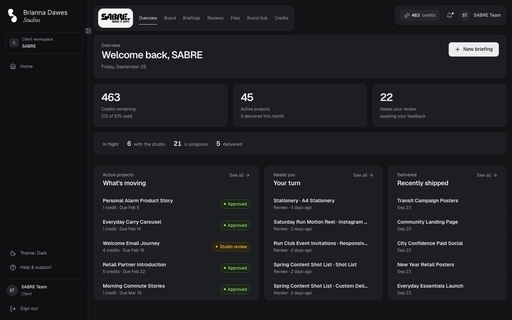
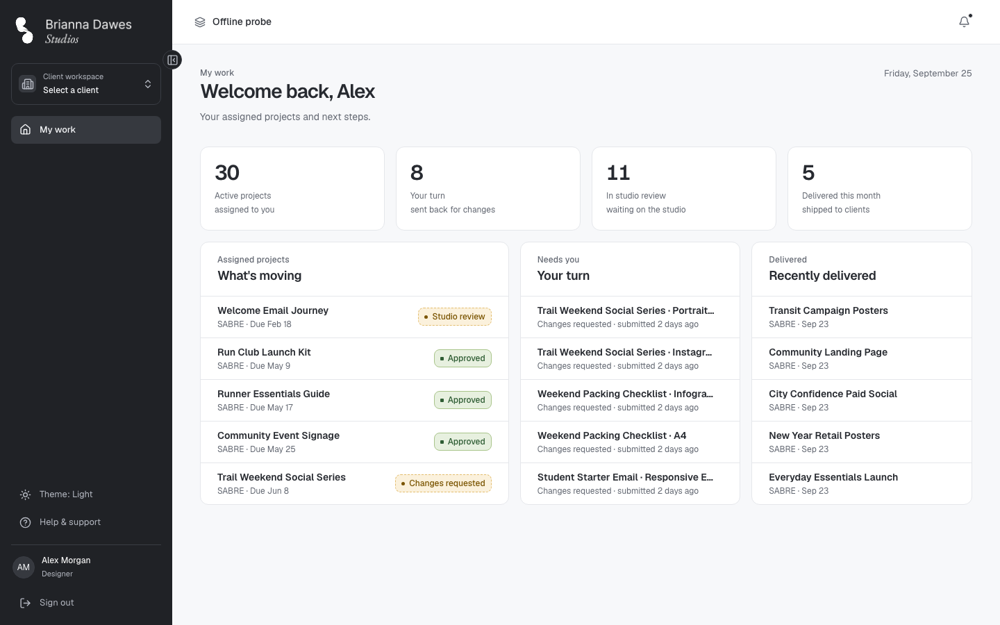
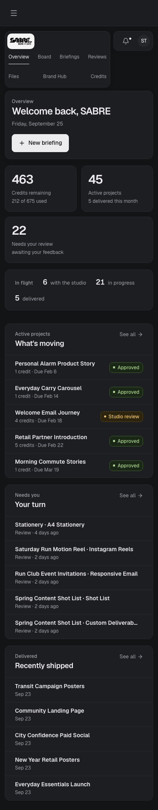

# Welcome dashboards for clients and designers — verification

Date: 2026-09-25 · Orchestrator: Claude Code · Workers: Sonnet (implementation, task reviews),
Haiku (checks), Opus (final review)

Scope: [design](../superpowers/specs/2026-09-25-role-overview-dashboards-design.md) and
[plan](../superpowers/plans/2026-09-25-role-overview-dashboards.md), commits `50b2bd4..143c6f3` on
local `main` plus this record. Each task was reviewed for spec compliance and quality before the
next began; worker reports are `docs/engineering/handoffs/2026-09-25-overview-*.md`.

## What the user gets

- **Client Overview** (`/clients/:clientId/overview`), the first link in the client navigation for
  clients and the studio. A client with one workspace lands there after sign-in, and a client with
  several opens each workspace's Overview from `/home`; designers who type the address are sent to
  the board. Tiles: credits remaining ("N of M used"), active projects (deliveries this month) and
  versions waiting on the client; an in-flight strip; columns What's moving, Your turn and Recently
  shipped, five rows each with "See all". The studio sees the same page as "What <client> sees".
- **Designer `/home`**: "Welcome back, <first name>" under the eyebrow "My work", four tiles and
  three columns of assigned work only, with no credits anywhere.
- **Studio `/home`**: the same welcome header over its existing Overview.
- `projects.delivered_at`, stamped by `mark_project_delivered` and backfilled from `updated_at`.
- Relative times ("yesterday", "last week") count calendar days in the studio time zone.

## Checks executed in this session

| Check | Result |
| --- | --- |
| `npm run check` at `143c6f3` (typecheck, lint, format, unit tests) | Pass, 1048 tests in 93 files |
| `supabase test db` at `143c6f3` | 22 files, 459 tests; only `access_and_workflows.test.sql` fails, on its six known SABRE-overlay assertions (2, 4, 9, 18, 32, 54); `project_delivered_at.test.sql` passes |
| Playwright at `143c6f3`: `overview`, `theme`, `client-navigation`, `client-pages-layout`, `production-workflow`, `console-errors`, `project-feedback`, `playground`, `board-views` | 46 passed, 0 failed, 0 skipped (the same set also passed 46 of 46 at `1bfb4d4`, before the final fix wave) |
| Designer headings in a browser (both seeded designers) | `/home`, "Welcome back, Alex" / "Welcome back, Jordan", eyebrow "My work", no credit text |

`canonical-workspaces.spec.ts` (its designer-heading lines changed) stops at its 25-project count on
the SABRE overlay before reaching them, as it did before this work; the browser check above covers
those lines. `workspace.spec.ts` (its client landing changed) was run by the Task 5 worker and
failed only on its known overlay card count, after the new Overview-to-Board steps had passed.

`overview.spec.ts` compares every client number with database reads rather than constants: the
three tiles, both tile notes and the in-flight strip, and the studio's view tile by tile against a
second browser signed in as the client. On the local SABRE data both read 463 credits remaining
(212 of 675 used), 45 active projects (5 delivered this month), 22 waiting on the client, and 6
with the studio, 21 in progress and 5 delivered. Designer Alex: 30 active, 8 sent back, 11 in studio
review, 5 delivered this month.

## Visual audit

24 captures at `143c6f3`: the client Overview as the client and as the studio, the designer `/home`
and the studio `/home`, in light and dark at 1440, 900 and 390 px (client routes shot with tall
viewports, since they scroll inside `main`). No horizontal overflow at any width; headings,
eyebrows and actions match each role; the dark theme keeps the client logo on its light plate.

Fixed from the audit (`1bfb4d4`, `df573f8`): four `.overview-stats` phone rules left in
`workspace.css` also styled the dashboards. A 32 px label minimum pushed each note 14 px down
below 640 px, and labels shrank below their notes under 375 px. The rules now live with the shared
tiles in `globals.css`, and a lone last tile fills its row on phones (the client's third tile).

Observed and left as is: the studio name "Offline probe" (documented test data); the client
navigation wraps to two rows at 390 px exactly as before the Overview link; 30 of SABRE's 45 active
overlay projects are past due and What's moving lists them first with no overdue cue, since the
application has no overdue concept.

## Findings fixed during task reviews

- Task 4: "1 credits" became "1 credit"; each "See all" link gained a distinct accessible name.
- Task 7: the studio test compares all three tiles with a second browser signed in as the client;
  the leak check matches whole internal notes; designer rows are checked by project id.
- Task 8: the header-date sentence, a reference-map observation and the D01 amendment's wording.

## Final whole-branch review

An Opus review of `96ad056..df573f8` found no Critical issue, no isolation defect and no migration
logic defect, and judged the work ready with fixes. One fix wave (`563761c..143c6f3`), confirmed by
a scoped re-review with every finding addressed, changed:

- Relative days are calendar days in the studio time zone (a new `formatDayKey` formatter); before,
  an evening upload read "today" the next morning.
- The designer's version read covers active projects only and pages past PostgREST's 1000-row cap.
- `.home-content`, `.home-actions` and `.home-date` moved to `globals.css` (two features use them).
- The migration's backfill no longer fires the `project_updated_at` trigger. The local database had
  already applied the original, so local delivered projects carry a 2026-09-25 `updated_at` (test
  data); deployments get the guarded version.
- The designer page shows its error and Try again when projects fail to load; clients with several
  workspaces open each Overview; designer rows say "Changes requested · submitted …", since versions
  carry no review timestamp; tests and README wording tightened.

One fix-wave commit (`cc2de97`) was made with `--no-verify`, which the worker disclosed. Re-running
its hooks afterwards found no gap: gitleaks reported no leaks, commitlint passed, and lint-staged has
no rule for migrations. The pgTAP suite does not call `mark_project_delivered`; the
`production-workflow` browser test checks its `delivered_at` stamp.

## Remaining gaps

- Browsers: Chromium only.
- The overlay-count suites (`workspace-actions`, `design-audit`, `canonical-workspaces`,
  `workspace`) keep their known SABRE-overlay failures; see the handoff.
