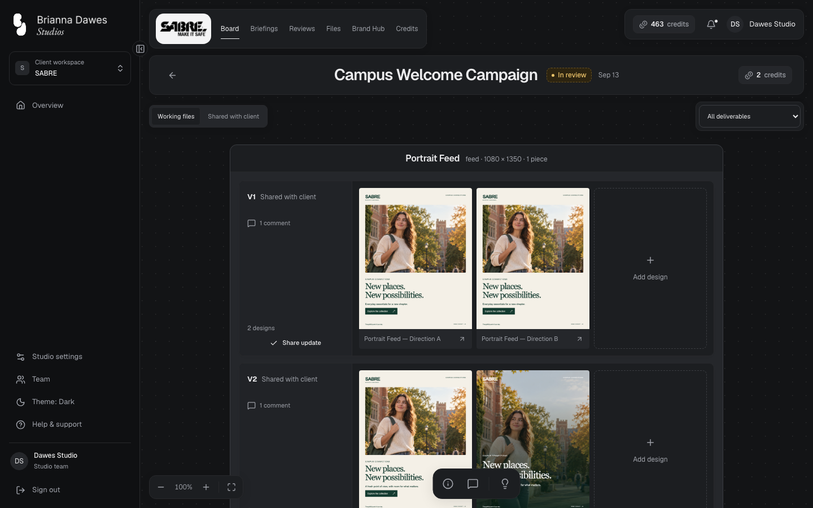
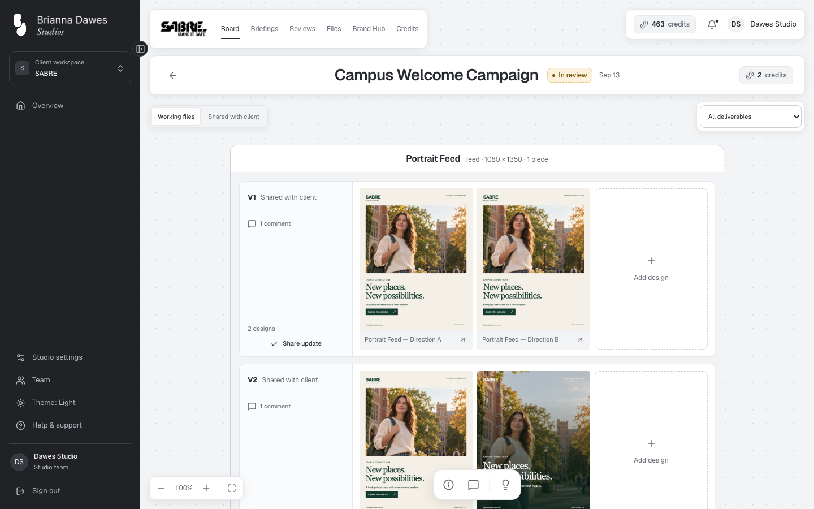
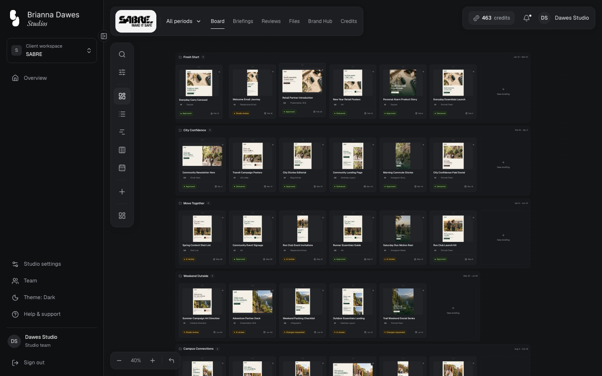
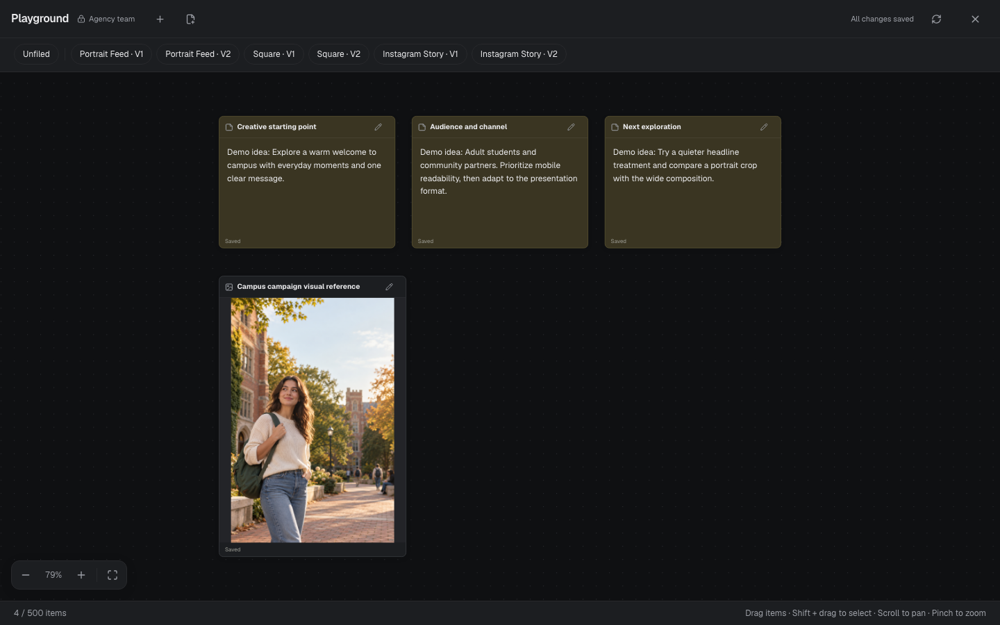
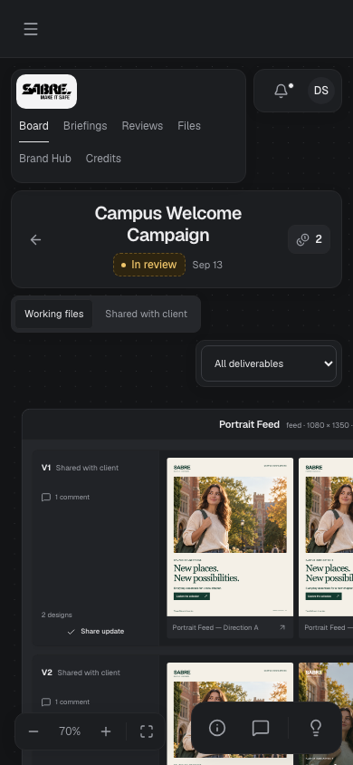

# Light and dark themes, dot grid, zoom pill and project tool bar — verification

Date: 2026-09-25 · Orchestrator: Claude Code · Workers: Sonnet (implementation, review), Haiku (checks)

Scope: [design](../superpowers/specs/2026-09-24-themes-and-canvas-design.md) and
[plan](../superpowers/plans/2026-09-24-themes-and-canvas.md), commits `47b50a7..8bdedd6` on local
`main`. Each task was reviewed for spec compliance and quality before the next began; worker
reports are `docs/engineering/handoffs/2026-09-25-themes-*.md`.

## Checks executed in this session

| Check | Result |
| --- | --- |
| `npm run check` at `8bdedd6` (typecheck, lint, format, unit tests) | Pass, 1013 tests in 86 files |
| Playwright at `8bdedd6`: `theme`, `playground`, `project-feedback`, `board-views`, `production-workflow`, `console-errors`, `video-designs`, `brand-canvas-final`, `project-creation-cards`, `client-navigation` | 49 passed, 0 failed, 0 skipped (the same set also passed 49 of 49 at `9873676`, before the fix wave) |
| `theme.spec.ts` re-run by the orchestrator | 3 of 3 passed |
| Pinned-theme computed styles on `/login` | System with a light OS: `#f7f8fa`; Dark pinned over a light OS: `rgb(19, 20, 22)`, `color-scheme: dark`; Light pinned over a dark OS: light; a stored Dark choice survives a reload |
| Colour gate and contrast (`features/shared/theme-colors.test.ts`) | 19 stylesheets free of literal colours outside `light-dark()`; 14 token pairs, 11 feature text pairs and 8 timeline bars (text 4.5:1, edges 3:1) at WCAG AA or better in both themes |

`workspace-actions`, `design-audit`, `canonical-workspaces` and `workspace` were not part of the
final pass; they fail only on the SABRE demonstration overlay's counts (see the handoff). During
Task 8, `workspace-actions` ran with only that known count failure, and its project-details and
conversation test passed through the new tool bar.

## Visual audit

72 captures: 12 views (login, overview, briefings, reviews, credits, settings, board list and
canvas, project, project with Conversation open, Playground, design viewer) × light and dark ×
1440, 900 and 390 px, signed in as the agency on the local SABRE data. Captures and contact sheets
are in the ignored `outputs/canvas-theme/`. No defect was found: the dark canvas shows its dot grid,
client logos sit on their light plate, native controls follow the theme, status badges keep their
tones, and the light theme matches its earlier captures apart from the dots, the zoom pill and the
tool bar. The login's split panels are close in tone in dark mode but remain distinct.

## Findings fixed during review

- Two READMEs still called the canvas a line grid (Task 6, fixed in `b28d57a`).
- An open side panel covered the tool bar's Playground button on canvases about 640–945 px wide
  (Task 8). The bar now re-centres between the zoom pill and the panel and steps aside below an
  800 px canvas while a panel is open (`8ace6d1`); `project-feedback.spec.ts` checks it with each
  panel open.
- Between Tasks 4 and 7 the zoom buttons stayed white in dark mode; the Task 7 pill takes its
  colours from the theme tokens.

## Final whole-branch review

An Opus review of `d2e64e5..9873676` found no Critical issue and judged the work ready with fixes.
One fix wave (`5d8c35f`, `8bdedd6`), confirmed by a scoped re-review, addressed:

- Keyboard order: the tool bar now precedes the canvas in the DOM, so Tab goes from the deliverable
  filter straight to Project details (checked in `project-feedback.spec.ts`).
- The Playground's dark note status text rose from 4.49:1 to 4.62:1, and the gate now also checks
  eleven feature-level text pairs.
- Fit View keeps the last row above the tool bar whenever the project can fit; at the 20% zoom
  floor a tall project pans instead.
- The head script follows a theme change from another tab on every page, including login.
- The colour gate discovers stylesheets recursively; documentation now describes the compiled
  `light-dark()` fallback and a few wording corrections.

Parked with a ruling: the zoom pill's and the tool bar's vertical centres differ by 4–6 px, because
aligning them needs a taller pill, which would break the 320 px layout.

## Remaining gaps

- The audit covered the agency role only; client and designer pages use the same tokens.
- Browsers: Chromium only. The CSS pipeline compiles `light-dark()` into a custom-property
  fallback (`--lightningcss-light` / `--lightningcss-dark`, seen in the served stylesheet), so the
  Chromium runs exercised that fallback and older engines are not expected to lose colours; Safari
  and Firefox were not run.
- Minor findings deferred by the task reviews are listed in the final whole-branch review.
